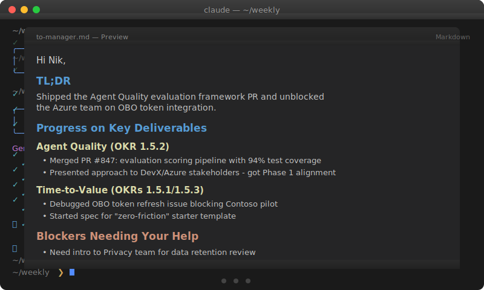

# Weekly Impact Reporting

**Stop forgetting what you accomplished. Start showing your impact.**

<p align="center">
  
</p>

You work hard all week—shipping code, reviewing PRs, attending meetings, mentoring teammates, researching solutions. But when it's time for your weekly check-in or performance review, you're staring at a blank page trying to remember what you actually did.

This project solves that problem with **Claude Code skills** that automatically collect evidence of your work from everywhere it happens:

<table>
<tr>
<td align="center"><br><b>GitHub</b><br><sub>PRs, Issues, Reviews</sub></td>
<td align="center"><br><b>Azure DevOps</b><br><sub>Work Items, Sprints</sub></td>
<td align="center"><br><b>Microsoft 365</b><br><sub>Email, Teams, Meetings</sub></td>
<td align="center"><br><b>Edge Browser</b><br><sub>Research, Documentation</sub></td>
<td align="center"><br><b>M365 Copilot</b><br><sub>Chat History</sub></td>
<td align="center"><br><b>Claude Code</b><br><sub>Sessions, Prompts</sub></td>
</tr>
</table>

Then AI analyzes your evidence against your goals and generates **impact reports tailored for different audiences**—your manager, skip-level, executive, and team.

## What You Can Accomplish

### Never Lose Track of Your Work Again
Every PR you reviewed, every work item you updated, every meeting where you spoke, every research rabbit hole you went down—it's all captured automatically.

### See Where Your Time Actually Goes
Get an honest breakdown of how your week aligned (or didn't) with your stated goals. Surface invisible labor that doesn't show up in commits but keeps things running.

### Generate Audience-Appropriate Updates in Seconds
- **For your manager**: Tactical progress, blockers, what's shipping
- **For skip-levels**: Strategic impact, cross-org coordination, team health
- **For executives**: Business outcomes, customer impact, decisions needed
- **For your team**: Context, recognition, support

### Build Your Promotion Case as You Go
Every week's evidence is preserved. When review season comes, you have months of documented impact ready to synthesize.

## Architecture

```
┌─────────────────────────────────────────────────────────────────────────────┐
│                              DATA SOURCES                                    │
├─────────────┬─────────────┬─────────────┬─────────────┬──────────┬──────────┤
│   GitHub    │ Azure DevOps│  Microsoft  │   M365      │  Claude  │   Edge   │
│             │             │    365      │   Copilot   │   Code   │ Browser  │
│  PRs, Issues│ Work Items  │Email, Teams │   Chat      │ Sessions │ History  │
│  Reviews    │ Revisions   │Meetings,Files│  History   │ Prompts  │ Research │
└──────┬──────┴──────┬──────┴──────┬──────┴──────┬──────┴────┬─────┴────┬─────┘
       │             │             │             │           │          │
       ▼             ▼             ▼             ▼           ▼          ▼
┌─────────────────────────────────────────────────────────────────────────────┐
│                           MCP SERVERS & TOOLS                                │
├─────────────┬─────────────┬─────────────┬─────────────┬──────────┬──────────┤
│   GitHub    │ Azure DevOps│   WorkIQ    │  Playwright │  Local   │Edge Hist │
│  MCP Server │  MCP Server │  MCP Server │   Scraper   │  Files   │MCP Server│
└──────┬──────┴──────┬──────┴──────┬──────┴──────┬──────┴────┬─────┴────┬─────┘
       │             │             │             │           │          │
       ▼             ▼             ▼             ▼           ▼          ▼
┌─────────────────────────────────────────────────────────────────────────────┐
│                          EVIDENCE COLLECTORS                                 │
│                         (Claude Code Skills)                                 │
├─────────────┬─────────────┬─────────────┬─────────────┬──────────┬──────────┤
│  /github-   │   /ado-     │   /m365-    │/m365copilot-│ /claude- │  /edge-  │
│  evidence   │  evidence   │  evidence   │  evidence   │ evidence │ evidence │
└──────┬──────┴──────┬──────┴──────┬──────┴──────┬──────┴────┬─────┴────┬─────┘
       │             │             │             │           │          │
       └─────────────┴─────────────┴──────┬──────┴───────────┴──────────┘
                                          │
                                          ▼
                              ┌───────────────────────┐
                              │   ~/weekly/weeks/     │
                              │     {date}/evidence/  │
                              │                       │
                              │  ├── github.md        │
                              │  ├── ado.md           │
                              │  ├── M365.md          │
                              │  ├── CopilotChat.md   │
                              │  ├── claude.md        │
                              │  └── edge.md          │
                              └───────────┬───────────┘
                                          │
                    ┌─────────────────────┼─────────────────────┐
                    │                     │                     │
                    ▼                     ▼                     ▼
          ┌─────────────────┐   ┌─────────────────┐   ┌─────────────────┐
          │   goals.md      │   │  config.yaml    │   │   Evidence      │
          │                 │   │                 │   │   Files         │
          │ Your OKRs &     │   │ Your name,      │   │                 │
          │ Key Results     │   │ recipients,     │   │ What you        │
          │                 │   │ org details     │   │ actually did    │
          └────────┬────────┘   └────────┬────────┘   └────────┬────────┘
                   │                     │                     │
                   └─────────────────────┼─────────────────────┘
                                         │
                                         ▼
                              ┌───────────────────────┐
                              │    /weekly-impact     │
                              │                       │
                              │  AI Analysis Engine   │
                              │                       │
                              │  • Aligns evidence    │
                              │    to goals           │
                              │  • Calculates time    │
                              │    investment %       │
                              │  • Surfaces themes    │
                              │  • Identifies gaps    │
                              └───────────┬───────────┘
                                          │
                                          ▼
                              ┌───────────────────────┐
                              │   ~/weekly/weeks/     │
                              │     {date}/impact/    │
                              │                       │
                              │  ├── impact.md        │◄── Full analysis
                              │  ├── to-manager.md    │◄── Tactical update
                              │  ├── to-skip-level.md │◄── Strategic view
                              │  ├── to-executive.md  │◄── Business outcomes
                              │  └── to-team.md       │◄── Team context
                              └───────────────────────┘
```

## Example Output

### Goal Alignment Scorecard
```
| Goal                        | Time Investment | Progress    | Trend |
|-----------------------------|-----------------|-------------|-------|
| 1. Agent Quality Hero       | 35%             | On Track    | ↑     |
| 2. Developer Time-to-Value  | 25%             | At Risk     | →     |
| 3. Modernize DevX Tooling   | 15%             | On Track    | ↑     |
| 4. AI-Forward Practices     | 10%             | Ahead       | ↑     |
| 5. Team Culture             | 5%              | On Track    | →     |
| Unaligned/Operational       | 10%             | -           | -     |
```

### Manager Update (Generated)
```markdown
Hi Nik,

## TL;DR
Shipped the Agent Quality evaluation framework PR and unblocked the Azure team
on OBO token integration.

## Progress on Key Deliverables

### Agent Quality (OKR 1.5.2)
- Merged PR #847: evaluation scoring pipeline with 94% test coverage
- Presented approach to DevX/Azure stakeholders - got alignment on Phase 1 scope

### Time-to-Value (OKRs 1.5.1/1.5.3)
- Debugged OBO token refresh issue blocking Contoso pilot
- Started spec for "zero-friction" starter template

## Blockers Needing Your Help
- Need intro to Privacy team for data retention review (blocking Ignite preview)

## Looking Ahead
- Finalizing Agent Quality whitepaper draft
- Luis 1:1 on Graph CLI migration ownership

---
Barry
```

## Installation

### Claude Code Plugin (Recommended)

```bash
# Install with one command
claude plugin install weekly-reporting@bgervin/weekly
```

Then configure:
```bash
# Copy templates to your config directory
mkdir -p ~/weekly-data
cp ~/.claude/plugins/weekly-reporting/config.example.yaml ~/weekly-data/config.yaml
cp ~/.claude/plugins/weekly-reporting/goals.example.md ~/weekly-data/goals.md

# Edit with your details
code ~/weekly-data/config.yaml
code ~/weekly-data/goals.md
```

**Optional:** For M365 Copilot chat evidence, install the scraper:
```bash
cd ~/.claude/plugins/weekly-reporting/tools/copilot-scraper
npm install
```

> **Tip:** Add the marketplace for easy updates:
> ```bash
> claude plugin marketplace add bgervin/weekly
> claude plugin update weekly-reporting
> ```

### Clone Directly (for customization)

```bash
git clone https://github.com/bgervin/weekly.git ~/weekly
cd ~/weekly
cp config.example.yaml config.yaml
cp goals.example.md goals.md
```

### Other Agent Skills-Compatible Tools

These skills follow the [Agent Skills](https://agentskills.io) specification and work with:
- Cursor
- VS Code (with Claude/Copilot extensions)
- Gemini CLI
- OpenAI Codex
- Roo Code, Amp, Goose, and 20+ more

Clone the repo and point your tool at the `skills/` directory.

## Environment Variables

```bash
export GITHUB_TOKEN="your-github-pat"
export ADO_ORG_URL="https://dev.azure.com/your-org"
export ADO_PAT="your-ado-pat"
```

## Usage

```bash
cd ~/weekly  # or your weekly-data directory
claude

# Collect evidence from all sources
> /github-evidence
> /ado-evidence
> /m365-evidence
> /m365copilot-evidence
> /claude-evidence
> /edge-evidence

# Generate impact reports
> /weekly-impact
```

## Skills Reference

| Skill | Data Source | What It Captures |
|-------|-------------|------------------|
| `/github-evidence` | GitHub API | PRs created/reviewed/merged, issues, comments |
| `/ado-evidence` | Azure DevOps API | Work item changes, state transitions, comments |
| `/m365-evidence` | Microsoft Graph | Emails sent, Teams messages, meetings attended, files edited |
| `/m365copilot-evidence` | Browser scraping | Copilot chat conversations and prompts |
| `/claude-evidence` | Local files | Claude Code sessions, prompts, projects worked on |
| `/edge-evidence` | Browser history | Research topics, documentation accessed, tools used |
| `/weekly-impact` | All evidence + goals | Comprehensive analysis and audience-specific reports |

## Directory Structure

```
weekly/
├── .claude-plugin/           # Plugin metadata
│   ├── plugin.json           # Plugin configuration
│   └── marketplace.json      # Marketplace manifest
├── skills/                   # The skills that power everything
│   ├── weekly-impact/
│   ├── ado-evidence/
│   ├── github-evidence/
│   ├── m365-evidence/
│   ├── m365copilot-evidence/
│   ├── claude-evidence/
│   └── edge-evidence/
├── tools/
│   └── copilot-scraper/      # Playwright-based M365 Copilot scraper
├── config.example.yaml       # Config template (committed)
├── goals.example.md          # Goals template (committed)
├── .mcp.json                 # MCP server configuration
│
│  ─── Personal (gitignored) ───
├── config.yaml               # Your settings
├── goals.md                  # Your goals & OKRs
└── weeks/
    └── 2026-01-25/
        ├── evidence/         # Raw evidence markdown files
        └── impact/           # Generated reports
```

## Requirements

- [Claude Code CLI](https://docs.anthropic.com/en/docs/claude-code)
- Node.js 18+ (for MCP servers and scraper)
- Edge browser (for M365 Copilot scraper with Windows SSO)
- GitHub personal access token
- Azure DevOps personal access token

## Philosophy

This project embodies a few beliefs:

1. **Your work has more impact than you remember.** The forgetting curve is real. Capture evidence while it's fresh.

2. **Different audiences need different stories.** Your executive doesn't need the same detail as your manager. Tailor the altitude.

3. **Goals without measurement are wishes.** Seeing where your time actually goes—versus where you intended—drives better decisions.

4. **AI should augment, not replace, your voice.** These reports are drafts. Edit them. Add your perspective. Make them yours.

## Contributing

The skills are just markdown files. Fork, customize, and make them work for your workflow. PRs welcome.

## License

MIT
